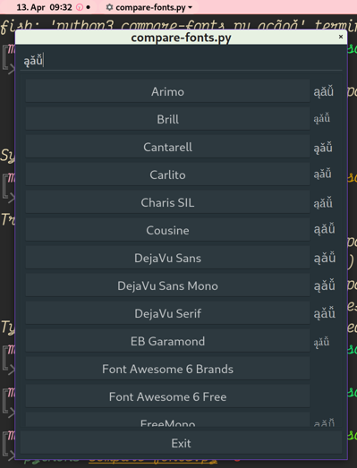
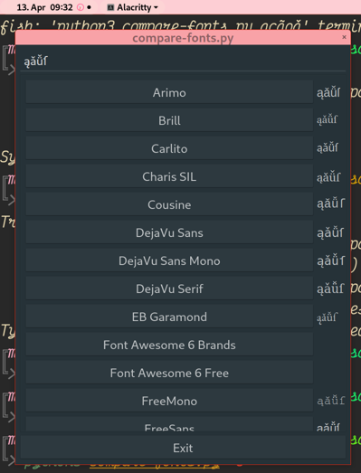

# Glyph finder: Discovers Linux fonts that *actually* contains the characters you want




Due to font fallbacks, it can be hard to find or compare fonts that cover characters you’re interested in.  This is made worse by the way coverage tables often underpromise on actually having glyphs for all the characters.

This code was hacked in a day to help locate fonts.  It’s made of 2 separate things:

 - A minimal library to find out fonts that fully cover a test string.
 - A minimal QT app to do that interactively, with font samples.

In the app, click a font name to copy it to clipboard.

# Install

```fish

apt install pyqt5-dev libfontconfig-dev python3-freetype

git clone https://github.com/ldo/python_fontconfig
cd python_fontconfig; sudo python3 setup.py install

git clone https://github.com/melissaboiko/glyph-finder
cd glyph-finder; sudo python3 setup.py install

```

(This is the only working fontconfig binding I could find.  The ones in pip including Python_fontconfig don't install, and the setuptools function to automatically fetch a git repo is getting some sort of cache which doesn't work.  Python!)

# Acknowledgements

Thank you, unknown author of the ‘compare-fonts’ pango/gtk2/python2 snippet that I had in my conffile for years till the relevant libraries died.  I used that code a lot, and it inspired this one.
